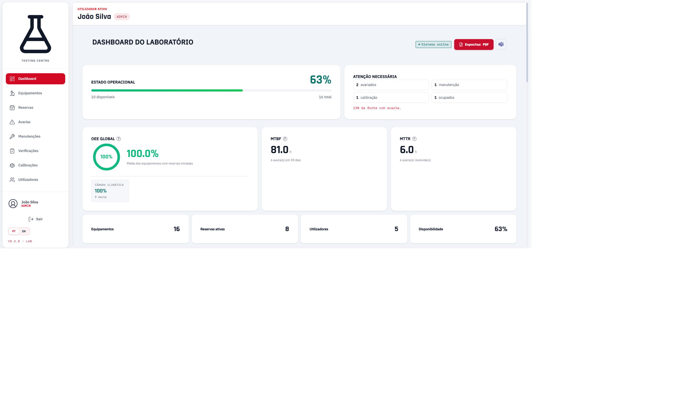

# PESTA — Industrial Testing Lab Asset & Operations Management Platform

**PESTA** é uma plataforma full-stack para gestão de ativos e operações em laboratórios de ensaios industriais, desenvolvida com React + FastAPI.

Centraliza o ciclo de vida dos equipamentos — desde inventário, reservas e utilização até manutenção, avarias, calibrações e análise de desempenho através de OEE, MTBF e MTTR.

Projeto académico/pessoal desenvolvido de raiz, incluindo schema de dados, API, interface, testes e regras de negócio. Avaliado com 19 valores.

<p align="center">
  
</p>

## Problem

Laboratórios de ensaios industriais podem ter dezenas de equipamentos partilhados — como câmaras climáticas, câmaras de choque térmico, fornos e salinas — utilizados por várias equipas.

Quando esta informação está dispersa por folhas de cálculo e conhecimento informal, tornam-se difíceis de controlar:

- disponibilidade real dos equipamentos;
- reservas e conflitos de utilização;
- equipamento indisponível ou em manutenção;
- histórico de avarias e intervenções;
- calibrações e respetivas validades;
- utilização e desempenho dos ativos.

## Solution

O PESTA centraliza este ciclo operacional numa única aplicação web.

Cada equipamento possui um estado operacional único e consistente:

**Disponível · Ocupado · Avariado · Em Manutenção · Em Calibração**

A API aplica as regras de utilização e valida as transições de estado, enquanto o sistema de reservas, check-in por QR Code e histórico de sessões permitem manter a rastreabilidade da utilização.

O dashboard agrega os dados operacionais para calcular indicadores como OEE, MTBF e MTTR.

## Key Features

**🏭 Asset Management**
- Inventário técnico de equipamentos.
- Estado operacional em tempo real.
- Organização por famílias de ativos.

**📅 Reservations & Scheduling**
- Calendário de utilização através de FullCalendar.
- Validação de conflitos de reserva.
- Gestão do ciclo de utilização dos equipamentos.

**🔧 Failures & Maintenance**
- Registo, acompanhamento e resolução de avarias.
- Manutenção preventiva e corretiva.
- Histórico de intervenções.
- Registo de custos e fornecedores.

**🎯 Calibration**
- Controlo da validade das calibrações.
- Alertas relacionados com vencimentos.

**📊 Industrial OEE**
- Cálculo de Disponibilidade, Performance e Qualidade.
- Indicadores por equipamento e família de ativos.
- Métricas complementares como MTBF e MTTR.

**🔍 Traceability**
- Histórico de sessões de utilização.
- Registo de eventos.
- Geração de relatórios em PDF.

**📱 QR Code Check-in**
- Identificação rápida dos equipamentos.
- Fluxo orientado para utilização em dispositivos móveis.

**🔐 Authentication & Profiles**
- Autenticação por PIN.
- Perfis de acesso diferenciados.
- Sessões autenticadas através de tokens opacos.

**🌍 Internationalization**
- Interface disponível em Português e Inglês.

## Architecture

```
┌─────────────────────┐
│     React / Vite     │
│      Frontend        │
└──────────┬───────────┘
           │
           │ REST API / JSON
           ▼
┌─────────────────────┐
│       FastAPI        │
│       Backend        │
└──────────┬───────────┘
           │
           ▼
┌─────────────────────┐
│ SQLModel / SQLAlchemy│
└──────────┬───────────┘
           │
           ▼
┌─────────────────────┐
│    SQLite + WAL       │
│  Current deployment   │
└──────────┬───────────┘
           │
           └── MSSQL-aware data-access layer
```

### Database

A implementação atual utiliza SQLite em modo WAL.

A camada de acesso a dados distingue o dialeto da ligação e inclui migrações condicionais para SQLite e MSSQL. O código está preparado para uma futura migração para SQL Server, mas essa migração não foi executada nem validada neste projeto.

## Technology Stack

| Área | Tecnologias |
|---|---|
| Backend | Python 3.12, FastAPI, SQLModel, SQLAlchemy |
| Database | SQLite + WAL |
| Migrations | Alembic |
| Scheduling | APScheduler |
| PDF | Playwright |
| Frontend | React, Vite, React Router |
| Calendar | FullCalendar |
| Charts | Recharts |
| Icons | Lucide |
| Internationalization | i18n (PT/EN) |
| Backend Tests | pytest |
| Frontend Tests | Vitest |

## Technical Decisions

### SQLite + WAL

Para o contexto atual de um único laboratório, SQLite evita a necessidade de um servidor de base de dados dedicado.

O WAL mode permite leituras concorrentes durante operações de escrita, sendo adequado ao cenário de utilização com múltiplos operadores e reservas.

A camada de acesso a dados já distingue o dialeto da ligação e contém lógica condicional para SQLite e MSSQL. A migração para SQL Server, contudo, não foi executada nem validada.

### State Machine

O estado do equipamento funciona como uma fonte de verdade única:

- Disponível
- Ocupado
- Avariado
- Em Manutenção
- Em Calibração

As transições inválidas são rejeitadas na API, e não apenas na interface.

Por exemplo:

- reservar equipamento indisponível;
- efetuar check-in inválido;
- criar estados incompatíveis com a utilização atual.

Esta abordagem aplica o princípio Poka-Yoke à camada de backend.

### PIN Authentication + Opaque Sessions

A autenticação utiliza:

- PIN;
- hash PBKDF2-SHA256;
- salt único por utilizador;
- tokens de sessão opacos;
- expiração de sessão.

Os tokens opacos permitem invalidação imediata da sessão no servidor, sem a necessidade de uma infraestrutura adicional de blocklist para JWTs.

### Server-side PDF Generation

Os relatórios PDF são gerados através de Playwright, utilizando HTML e CSS.

Esta abordagem permite reutilizar estilos web para os relatórios em vez de depender de APIs de desenho de PDF de baixo nível.

## Project Structure

```
.
├── Backend/
│   ├── app/
│   │   ├── core/          # configuração, segurança, dependências
│   │   ├── db/             # engine e migrações Alembic
│   │   ├── models/         # modelos SQLModel
│   │   ├── routers/        # endpoints FastAPI
│   │   ├── schemas/        # schemas Pydantic
│   │   └── services/       # lógica de negócio e serviços
│   ├── scripts/             # utilitários de dados de demonstração
│   └── tests/               # suite pytest
│
└── Frontend/
    └── src/
        ├── components/      # componentes reutilizáveis
        ├── contexts/        # autenticação e idioma
        ├── hooks/           # hooks de dados por domínio
        ├── i18n/            # traduções PT/EN
        ├── pages/           # páginas da aplicação
        └── utils/           # cálculos e configuração de rede
```

## Installation

### Prerequisites

- Python 3.12
- Node.js / npm

### 1. Clone

```bash
git clone https://github.com/Arckira/PESTA.git
cd PESTA
```

### 2. Backend

```bash
cd Backend
python -m venv .venv
```

Windows:

```bash
.venv\Scripts\activate
```

Instalar dependências:

```bash
pip install -r requirements.txt
```

Criar configuração local:

```bash
copy .env.example .env
```

Ajustar as variáveis conforme necessário e iniciar:

```bash
python run.py
```

Alternativamente:

```bash
uvicorn app.main:app --reload --host 0.0.0.0 --port 8000
```

### 3. Frontend

Num segundo terminal:

```bash
cd Frontend
npm install
copy .env.example .env
npm run dev
```

O frontend utiliza o proxy `/api` para comunicar com o backend durante o desenvolvimento.

## Testing

### Backend

```bash
cd Backend
pytest
```

### Frontend

```bash
cd Frontend
npx vitest run
```

### Build

```bash
cd Frontend
npm run build
```

## Validation

O estado atual do repositório foi validado a partir de um clone limpo, incluindo:

- instalação das dependências Python;
- execução de migrations reais;
- arranque do backend;
- `/health` e `/docs`;
- instalação e execução do frontend;
- proxy `/api`;
- bootstrap de administrador;
- autenticação;
- criação e consulta de equipamentos;
- check-in e transições de estado;
- dashboard OEE;
- validação através do browser com Playwright.

Testes automatizados atualmente validados:

```text
Backend   → 19 passed
Frontend  → 3 passed
Build     → successful
```

Não foram feitas alterações ao código para fazer os testes passar durante esta validação.

## Engineering Practices

### Modular Architecture

O backend está organizado por responsabilidades:

- models
- schemas
- routers
- services
- core

A lógica de negócio é mantida fora dos endpoints sempre que apropriado.

### Transaction Safety

Operações críticas utilizam sessões transacionais e rollback explícito em caso de erro, preservando a integridade das operações na base de dados.

### Poka-Yoke

A prevenção de erro é aplicada através de:

- validação Pydantic;
- máquina de estados;
- validação de reservas;
- prevenção de transições inválidas;
- regras de utilização aplicadas na API.

### Resilience

Existem tratamentos explícitos para pontos de falha relevantes, incluindo:

- base de dados;
- geração de PDF;
- tarefas agendadas.

### Structured Logging

O backend utiliza o módulo `logging` do Python com níveis apropriados em vez de `print()`.

### Automated Testing

A suite de testes cobre regras críticas relacionadas com:

- OEE;
- reservas;
- máquina de estados;
- autenticação e segurança.

### Internationalization

A interface está disponível em Português e Inglês.

Não são reivindicadas certificações formais ISO/IATF. As práticas apresentadas seguem princípios de engenharia habitualmente associados a esses referenciais, aplicados ao nível do código.

## Security

- Autenticação por PIN com PBKDF2-SHA256 + salt único por utilizador.
- Tokens de sessão aleatórios e opacos com expiração.
- Não são utilizados JWTs nem uma chave secreta estática.
- Novos utilizadores recebem inicialmente o PIN `0000`, mas são obrigados a alterá-lo antes de obter acesso normal ao sistema.
- `.env`, bases de dados locais, executáveis, backups e logs estão excluídos do controlo de versões.
- Não existem credenciais, API keys ou connection strings reais no repositório.
- O projeto foi anonimizado a partir da versão original, removendo referências específicas à organização, logótipos e outros identificadores proprietários.

### Dependency Audit

`npm audit` identificou vulnerabilidades em dependências de build do frontend relacionadas com `vite`, `esbuild`, `postcss` e `nanoid`.

As findings estão atualmente na árvore de `devDependencies`, não nas `dependencies` de runtime. A atualização automática não foi aplicada porque a correção disponível implicaria uma atualização major do Vite.

Estas dependências devem ser revistas antes de qualquer deployment de produção.

## Project Status

**Current status: validated release candidate**

O repositório atual foi submetido a uma validação a partir de um clone limpo, incluindo instalação, migrations, testes automatizados e execução end-to-end da aplicação.

Não são feitas afirmações de ausência absoluta de bugs ou de certificação de segurança.

## License / Usage

Projeto pessoal/académico publicado como amostra de portfólio.

Não foi atribuída uma licença open-source formal. Consulte o autor antes de reutilizar ou redistribuir o projeto comercialmente.

## Notes

- Dados de demonstração podem ser gerados através de `Backend/seed_demo_poster.py`. Consulte as instruções no próprio ficheiro antes de executar o script.
- O screenshot original do dashboard foi removido durante a anonimização por conter branding da organização original.
- Um novo screenshot/GIF de demonstração pode ser adicionado posteriormente para melhorar a apresentação visual do projeto.

## Author

**Tiago Gonçalves**

Projeto desenvolvido no âmbito académico e como demonstração de competências em:

Industrial Engineering · Software Development · Asset Management · Data & Operations · Full-Stack Development
